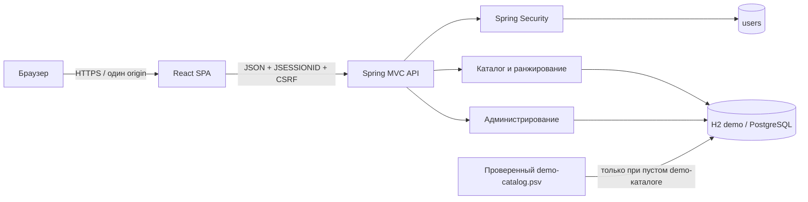

# Архитектура ThermoSelect

## Общая схема

ThermoSelect поставляется как одно Spring Boot приложение. Maven собирает React/Vite в `target/frontend-dist`, копирует результат в classpath `/static` и упаковывает его вместе с API.



Исходник: [`diagrams/components.mmd`](diagrams/components.mmd). Рендер: [`diagrams/components.svg`](diagrams/components.svg).

## Компоненты

| Компонент | Ответственность |
| --- | --- |
| React SPA | маршруты, формы, фильтры, карточки, сравнение и админские экраны |
| API client | JSON, `credentials: include`, CSRF-токен в памяти, единая обработка ошибок |
| Spring Security | session login/logout, CSRF, роли, повторная проверка состояния пользователя |
| CatalogQueryService | строгие ограничения, вычисление рейтинга, пагинация и объяснения |
| CatalogAdminService | CRUD, optimistic locking, публикация и архивирование |
| CatalogDemoSeeder | идемпотентная загрузка 42 записей только в demo-профиле |
| Flyway | одинаковая даталогическая схема H2/PostgreSQL |

## Профили

- `demo` — запускается только явно, файловая H2 в PostgreSQL compatibility mode, demo-аккаунты и исходный каталог.
- `test` — изолированная in-memory H2, миграции и тестовые фикстуры.
- `postgres` — внешняя PostgreSQL, секреты и администратор только через переменные окружения.

## Безопасность

1. Публично выдаются только SPA shell, login/register и `GET /api/auth/csrf`.
2. Каталог, карточки, сравнение и справочники требуют активной роли `USER` или `ADMIN`.
3. `/api/admin/**` требует `ADMIN` и дополнительно защищён `@PreAuthorize`.
4. Все изменяющие запросы требуют CSRF header, полученный для текущей сессии.
5. При входе меняется session ID; при выходе сессия удаляется и очищается `JSESSIONID`.
6. Фильтр актуализирует роль и `enabled` по БД на каждом защищённом запросе.
7. UI-route fallback не перехватывает `/api/**`, assets или пути с расширением.

## Формат ошибок

```json
{
  "timestamp": "2026-07-12T15:00:00Z",
  "status": 400,
  "error": "Bad Request",
  "code": "VALIDATION_FAILED",
  "message": "Ошибка валидации данных",
  "details": ["model: Модель обязательна"],
  "path": "/api/admin/heat-exchangers"
}
```
