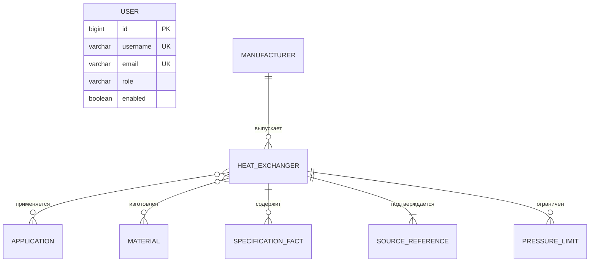

# Концептуальная и даталогическая модели

## Концептуальная модель

Центральная сущность — теплообменный аппарат. Он принадлежит производителю, имеет области применения и материалы, содержит общие числовые характеристики, произвольные паспортные факты, источники и точки зависимости давления от температуры.

Исходник: [`diagrams/data-model.mmd`](diagrams/data-model.mmd). Рендер: [`diagrams/data-model.svg`](diagrams/data-model.svg).

## Даталогическая модель

| Таблица | Назначение | Ключевые ограничения |
| --- | --- | --- |
| `users` | учётные записи и роли | unique username/email, BCrypt hash |
| `manufacturers` | производители | unique name, optimistic `version` |
| `heat_exchangers` | общие данные и числовые диапазоны | unique slug, FK manufacturer, optimistic `version` |
| `applications` | справочник областей применения | immutable unique code |
| `materials` | справочник материалов | immutable unique code |
| `heat_exchanger_applications` | M:N аппарат–применение | составной PK |
| `heat_exchanger_materials` | M:N аппарат–материал | составной PK |
| `heat_exchanger_facts` | типоспецифичные характеристики | FK с cascade delete |
| `heat_exchanger_sources` | официальные источники | обязательны URL, дата и основание измерений |
| `heat_exchanger_pressure_limits` | точки pressure/temperature | положительные значения, FK аппарата |

## Принципы хранения

- `family`: `PLATE`, `SHELL_TUBE`, `AIR_COOLED`, `SPIRAL`.
- `granularity`: `EXACT_CONFIGURATION`, `STANDARD_MODEL`, `SERIES`.
- `status`: `DRAFT`, `PUBLISHED`, `ARCHIVED`.
- Значение, которого нет в официальном источнике, хранится как SQL `NULL`, а не `0`.
- Мощность не входит в единый набор общих характеристик и не используется в поиске: она зависит от рабочего режима. Оставшиеся в миграции nullable-столбцы обеспечивают обратную совместимость существующей БД.
- Давление, зависящее от температуры, хранится набором точек, а не одним универсальным максимумом.
- Все числа нормализованы к СИ; исходная трактовка фиксируется в `measurement_basis`.
- Публичный поиск видит только `PUBLISHED`; DELETE переводит запись в `ARCHIVED`.
