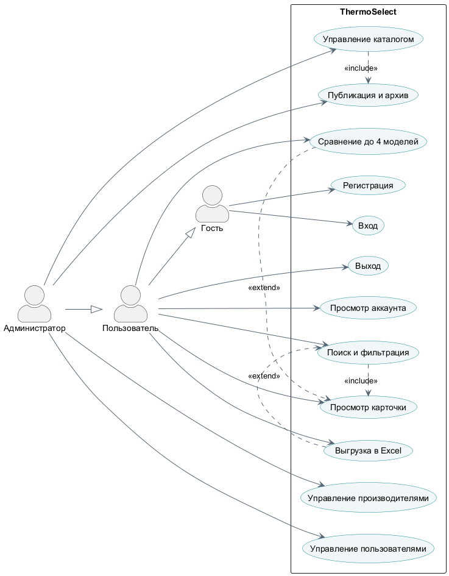
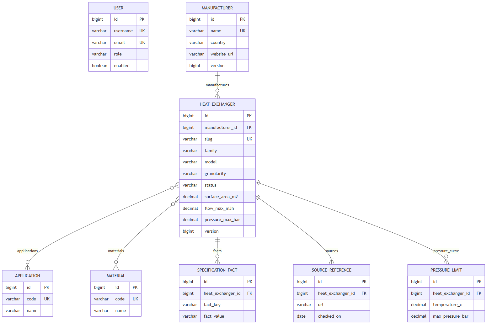
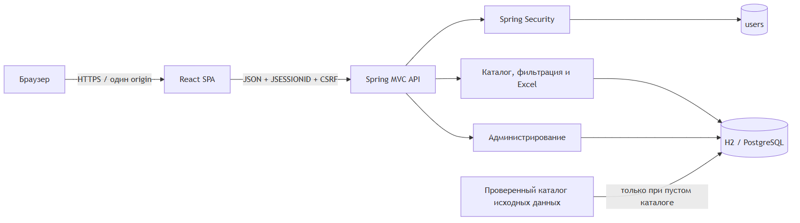
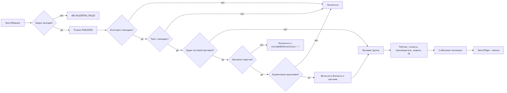

# АННОТАЦИЯ

В отчёте рассмотрена разработка информационно-поисковой системы ThermoSelect для выбора теплообменных аппаратов. Выполнен анализ предметной области, определены информационные потребности пользователя и администратора, сформированы концептуальная и даталогическая модели базы данных. Разработаны алгоритм строгой фильтрации и объяснимого ранжирования, web-интерфейс, серверное API и подсистема session-аутентификации.

Каталог включает 42 записи четырёх семейств: пластинчатые, кожухотрубные, воздушные и спиральные теплообменники. Для каждой записи указаны производитель, модель, гранулярность, область применения, материалы, числовые параметры, специальные факты и официальный источник. Значения, отсутствующие в открытых материалах производителя, заполнены детерминированными демонстрационными данными и явно помечены как `DEMO`.

Приложение реализовано на React 19 и Spring Boot 4.1. Схема данных управляется Flyway; для демонстрации используется файловая H2, для эксплуатации предусмотрена PostgreSQL. Проверка одной командой включает Java integration-тесты, Vitest и production-сборку единого исполняемого JAR.

Ключевые слова: теплообменник, информационно-поисковая система, React, Spring Boot, PostgreSQL, H2, Flyway, CSRF, ранжирование, каталог.

<!-- pagebreak -->

# СОДЕРЖАНИЕ

# ВВЕДЕНИЕ

Теплообменные аппараты применяются в отоплении, вентиляции, холодильной технике, энергетике, пищевой и химической промышленности. Производители публикуют сведения в разных форматах: web-карточках, листах конкретной конфигурации и каталогах серий. Одинаковые по назначению аппараты могут отличаться конструкцией, материалами, допустимыми температурами, давлением, диапазонами расхода и требованиями к обслуживанию.

Ручной просмотр нескольких каталогов затрудняет первичный выбор. Дополнительную проблему создаёт различная гранулярность сведений: значение для конкретного артикула можно использовать непосредственно, а диапазон серии требует уточнения комплектации. Мощность теплообменника также не является постоянной паспортной величиной и зависит от рабочих сред, расходов, температурного графика и допустимого гидравлического сопротивления.

Цель практики — разработать информационно-поисковую web-систему, которая хранит структурированные сведения о теплообменниках, выполняет строгую фильтрацию, ранжирует результаты и объясняет причины совпадения без подмены инженерного теплового расчёта.

Для достижения цели решены следующие задачи:

- проанализированы официальные материалы производителей;
- разработаны концептуальная, логическая и физическая модели данных;
- определены роли пользователя и администратора, построены UML-сценарии;
- реализованы регистрация, вход, каталог, фильтры, карточка, сравнение и административные функции;
- разработан алгоритм нормализованного ранжирования;
- подготовлены тесты, инструкции по запуску, журналы и материалы защиты.

# 1 АНАЛИЗ ПРЕДМЕТНОЙ ОБЛАСТИ

## 1.1 Назначение и типы теплообменных аппаратов

Теплообменник обеспечивает передачу теплоты между средами, разделёнными поверхностью теплообмена либо контактирующими в специально организованном процессе. В границах проекта рассматриваются четыре семейства аппаратов.

| Семейство | Конструктивная особенность | Типовые области применения |
|---|---|---|
| Пластинчатые | Пакет профилированных пластин; разборное или паяное исполнение | отопление, охлаждение, HVAC, холодильная техника |
| Кожухотрубные | Пучок труб внутри кожуха; возможны разные материалы и число ходов | промышленность, энергетика, масла, морские системы |
| Воздушные | Оребрённый теплообменный блок с вентиляторами | конденсация, drycooling, холодильные установки, дата-центры |
| Спиральные | Один или два спиральных канала, устойчивых к загрязнению | загрязнённые среды, рекуперация, конденсация, сточные воды |

Система не выполняет окончательный подбор. Она сокращает множество кандидатов и формирует объяснимый список для последующего обращения к производителю или выполнения инженерного расчёта.

## 1.2 Пользователи и информационные потребности

Обычному пользователю необходимы регистрация, вход, просмотр справочников, поиск по типу и характеристикам, детальная карточка и сравнение нескольких вариантов. Он должен видеть не только итоговый балл, но и основание ранжирования, запас параметров, гранулярность записи и происхождение данных.

Администратор поддерживает качество каталога: создаёт и редактирует записи, публикует или архивирует их, управляет производителями и пользователями. Система запрещает администратору удалять, блокировать или лишать роли собственную учётную запись, чтобы не потерять управление.

## 1.3 Источники и качество данных

Исходные сведения собраны с официальных ресурсов Alfa Laval, Danfoss, Kelvion, SWEP и API Heat Transfer. Каждая запись содержит URL, название источника, дату проверки и текстовое основание измерений. Дополнительно хранится гранулярность.

| Гранулярность | Смысл | Уровень доверия при ранжировании |
|---|---|---|
| `EXACT_CONFIGURATION` | конкретный SKU или заранее определённая комплектация | высокий |
| `STANDARD_MODEL` | стандартная модель с опубликованными параметрами | средний |
| `SERIES` | конфигурируемая серия и её общий диапазон | требует уточнения |

Открытые каталоги не содержат одинаковый набор характеристик для всех 42 записей. По требованию практической демонстрации пустые общие поля заполнены воспроизводимыми mock-значениями. Они перечисляются в `mockFields`, показываются в интерфейсе с бейджем `DEMO` и сопровождаются предупреждением о запрете использования для sizing. Такой подход позволяет проверить все фильтры, не выдавая синтетические значения за паспортные.

<!-- pagebreak -->

## 1.4 Состав демонстрационного каталога

| Производитель | Семейство | Количество |
|---|---|---:|
| Alfa Laval | пластинчатые Fast Track | 8 |
| Danfoss | пластинчатые B3 | 6 |
| Kelvion | пластинчатые NX | 6 |
| SWEP | пластинчатые All-Stainless | 4 |
| Basco | кожухотрубные | 6 |
| Kelvion | воздушные | 6 |
| Alfa Laval | спиральные SHE | 6 |
| **Итого** |  | **42** |

# 2 ТРЕБОВАНИЯ И ВАРИАНТЫ ИСПОЛЬЗОВАНИЯ

## 2.1 Функциональные требования

Публичная часть содержит лендинг, регистрацию и вход. После авторизации пользователь получает доступ к каталогу, фильтрам, карточкам, сравнению и read-only странице учётной записи. Административная часть содержит обзор, список записей, редактор, смену статусов и управление пользователями.

Строгие числовые фильтры должны исключать аппарат, который не покрывает требование. Пагинация должна быть стабильной. Сравнение принимает от двух до четырёх уникальных идентификаторов и сохраняет порядок пользователя. Удаление записи каталога заменяется архивированием.

## 2.2 Нефункциональные требования

- единый исполняемый JAR и один origin для UI/API;
- русский адаптивный интерфейс;
- относительные API URL и отсутствие production CORS;
- Flyway как единственный владелец схемы;
- optimistic locking для административных изменений;
- единый JSON-формат ошибок;
- 30-минутная session-аутентификация и немедленный отзыв доступа;
- воспроизводимые Java- и React-тесты.

## 2.3 UML вариантов использования



Пользователь работает только с опубликованными данными. Администратор наследует пользовательские сценарии и получает команды изменения. Проверка роли выполняется сервером для каждого ADMIN endpoint; скрытие пункта меню во frontend не является механизмом безопасности.

## 2.4 Критерии выбора архитектуры и инструментов

Технологии выбирались не по популярности как самостоятельному показателю, а по соответствию ограничениям проекта. Основными критериями стали: реализация всех пользовательских и административных сценариев, безопасность session-аутентификации, повторное использование исходного модуля авторизации, возможность демонстрации на разных компьютерах, воспроизводимая сборка, автоматическое тестирование и завершение работы в срок учебной практики.

При сравнении учитывались также эксплуатационные свойства. Решение должно запускаться без установки отдельного frontend-сервера, работать с одной точкой входа, не требовать CORS в production и сохранять возможность перехода с локальной базы на серверную СУБД. Поэтому «лучшим» далее называется вариант, который получил наилучшее соответствие именно этим требованиям. При других условиях — например, обязательной автономной работе без браузера или наличии корпоративного стандарта .NET — итоговый выбор мог бы отличаться.

## 2.5 Обоснование web-интерфейса

Для пользовательского интерфейса сравнивались web-приложение, настольное приложение JavaFX, desktop-оболочка Electron и консольная программа.

| Форма | Преимущества | Ограничения для ThermoSelect | Выбор |
|---|---|---|---|
| Web SPA | запуск в браузере, единое обновление, адаптивность, доступ с разных ОС, удобные формы и таблицы | требуется браузер и запущенный сервер | выбран |
| JavaFX | полноценное desktop-приложение, доступ к возможностям ОС, возможна автономная работа | отдельная установка и доставка обновлений, дополнительная реализация адаптивного интерфейса | не выбран |
| Electron | общий стек HTML, CSS и JavaScript, кроссплатформенная desktop-сборка | в поставку включаются Chromium и Node.js; отдельный установщик не решает задачу централизованного каталога | не выбран |
| CLI | минимальные требования к интерфейсу и ресурсам | неудобны фильтры, сравнение, графическое объяснение рейтинга и администрирование | не выбран |

Web-интерфейс выбран как наиболее подходящий, поскольку каталог является многопользовательской информационной системой, а не локальным инженерным калькулятором. Браузер уже предоставляет стандартные элементы форм, навигацию, доступность и адаптацию к экрану. Размещение React и API на одном origin упрощает cookie-сессии и CSRF-защиту. Установка клиента на каждое рабочее место не требуется: для обновления достаточно заменить серверный JAR. Electron был бы оправдан при необходимости автономной desktop-работы или интеграции с локальным оборудованием, которых в задании нет.

## 2.6 Выбор frontend-стека

React сопоставлялся с Vue и Angular по шкале от 1 до 5. Вес показывает значимость критерия для текущего проекта; итоговая оценка является взвешенной суммой и служит прозрачным обоснованием, а не универсальным рейтингом технологий.

| Критерий | Вес, % | React | Vue | Angular |
|---|---:|---:|---:|---:|
| Компонентная реализация сложных экранов | 25 | 5 | 5 | 5 |
| Совместимость с JavaScript и JSDoc | 20 | 5 | 5 | 2 |
| Скорость освоения и реализации | 15 | 4 | 5 | 2 |
| Тестирование и маршрутизация | 15 | 5 | 4 | 5 |
| Контроль состава зависимостей | 10 | 4 | 4 | 2 |
| Соответствие уже созданному коду | 15 | 5 | 2 | 2 |
| **Взвешенный итог** | **100** | **4,75** | **4,30** | **3,20** |

React предоставляет компонентную модель и не навязывает полный набор подсистем. Это удобно для проекта, где маршрутизация выбрана отдельно, а глобальное состояние ограничено контекстами авторизации и сравнения. Vue является сильным аналогом: он также компонентный, декларативный и удобен для постепенного внедрения. Однако переход на Vue не дал бы функционального выигрыша и потребовал бы переписать готовые React-компоненты и тесты. Angular предоставляет целостный framework, строгую структуру и развитые средства для крупных команд, но предполагает более тяжёлую модель приложения и знание TypeScript, декораторов и дополнительных концепций. Для ограниченного по срокам проекта это увеличивает стоимость без необходимости.

Vite выбран вместо ручной конфигурации Webpack как готовая цепочка разработки и production-сборки с быстрым dev-сервером, HMR и оптимизированными статическими ресурсами. Vitest использует совместимую с Vite среду и не требует второй независимой конфигурации преобразования JSX. Redux не применён, поскольку разделяемое состояние невелико: добавление отдельного хранилища увеличило бы число абстракций без измеримого упрощения текущих сценариев. UI-фреймворк также не используется, чтобы сохранить инженерный визуальный стиль и не включать большой набор невостребованных компонентов.

## 2.7 Выбор backend и базы данных

В качестве серверных аналогов рассматривались NestJS и ASP.NET Core. NestJS позволил бы использовать JavaScript или TypeScript на обоих уровнях и предоставляет модули, guards, validation и средства тестирования. ASP.NET Core является зрелым кроссплатформенным framework с dependency injection, средствами безопасности и производительным web-сервером. Оба варианта технически пригодны.

Spring Boot выбран по совокупности проектных факторов. В исходном репозитории уже находились Java-модель пользователя и основа авторизации, поэтому их развитие безопаснее полного переноса. Spring Security предоставляет единый фильтровый конвейер для session-аутентификации, CSRF и разграничения ролей; Spring Data JPA согласуется с реляционной моделью каталога; Spring Boot Maven Plugin формирует исполняемый JAR. Переход на NestJS или ASP.NET Core потребовал бы повторной реализации и повторной проверки наиболее критичного участка — безопасности — без изменения функций для пользователя.

Для production-профиля сравнивались PostgreSQL, MySQL и SQLite. PostgreSQL и MySQL поддерживают транзакции, ограничения и многопользовательскую работу. PostgreSQL выбран благодаря строгой реляционной модели, развитым ограничениям целостности, MVCC и поддержке стандартных уровней изоляции. Эти свойства соответствуют административному CRUD и optimistic locking. MySQL остаётся допустимой альтернативой, но потребовал бы отдельной проверки SQL-совместимости миграций. SQLite удобен как встраиваемый файл, однако не является целевой серверной СУБД для одновременной работы пользователей и администраторов.

H2 используется только в профилях `test` и `demo`: она запускается без установки СУБД и позволяет показать сохраняемые данные на защите. Такое разделение сочетает простой демонстрационный запуск и корректную production-архитектуру. Flyway выбран единственным владельцем схемы, потому что версионируемые миграции воспроизводимы и применимы как к чистой, так и к существующей базе; Hibernate настроен на проверку схемы, а не на её неявное изменение.

## 2.8 Выбор способа сборки и развёртывания

Рассматривались два варианта: независимые frontend и backend с отдельными серверами либо модульный монолит в одном JAR. Раздельное развёртывание полезно, когда части масштабируются независимо, имеют разные команды сопровождения или требуют CDN. Для ThermoSelect эти преимущества не компенсируют настройку двух поставок, CORS, отдельных адресов и координацию версий API.

Выбран единый исполняемый JAR. Maven устанавливает закреплённый Node, выполняет `npm ci`, React-тесты и Vite build, копирует статические файлы и только затем упаковывает Spring Boot. В результате одной командой проверяются обе части, а демонстрация требует один процесс. Микросервисное разбиение также отклонено: авторизация, каталог и администрирование используют одну транзакционную модель и не имеют независимой нагрузки, поэтому распределённые сессии, сетевые отказы и несколько баз данных создали бы сложность без пользы для задания.

# 3 ПРОЕКТИРОВАНИЕ БАЗЫ ДАННЫХ

## 3.1 Концептуальная модель

Центральная сущность `heat_exchangers` связана с производителем, областями применения, материалами, типоспецифичными фактами, источниками и температурно-барическими ограничениями. Пользователи хранятся отдельно, поскольку их жизненный цикл не зависит от каталога.



Модель разделяет общие фильтруемые атрибуты и специальные факты. Это позволяет эффективно выполнять числовые ограничения и не расширять таблицу отдельным столбцом для каждой конструктивной особенности.

## 3.2 Состав таблиц

| Таблица | Назначение | Основные поля |
|---|---|---|
| `users` | учётные записи и роли | username, email, password_hash, role, enabled, version |
| `manufacturers` | производители | name, country, website_url, version |
| `heat_exchangers` | общие параметры карточки | slug, family, model, granularity, status, площадь, расход, мощность, температура, давление, габариты, масса, version |
| `applications` | справочник применений | code, name |
| `materials` | справочник материалов | code, name |
| `heat_exchanger_applications` | M:N аппаратов и применений | heat_exchanger_id, application_id |
| `heat_exchanger_materials` | M:N аппаратов и материалов | heat_exchanger_id, material_id |
| `specification_facts` | специальные свойства | fact_key, label, value, unit, sort_order |
| `source_references` | источники | title, url, checked_on, measurement_basis |
| `pressure_limits` | точки температурно-барической кривой | temperature_c, max_pressure_bar, note |

## 3.3 Целостность и версии

Уникальные ограничения установлены для имени производителя, кодов справочников, username, email и slug. Внешние ключи предотвращают появление фактов или источников без родительской записи. Поле `version` используется JPA для optimistic locking: если два администратора открыли одну форму, сохранение устаревшей версии завершается конфликтом HTTP 409.

Статусы `DRAFT`, `PUBLISHED` и `ARCHIVED` отделяют подготовку данных от пользовательского каталога. Физическое удаление аппарата не выполняется: DELETE переводит запись в `ARCHIVED`.

# 4 АРХИТЕКТУРА И РЕАЛИЗАЦИЯ

## 4.1 Компонентная схема



React-приложение собирается Vite в статические ресурсы Spring Boot. В production браузер обращается к UI и API с одного origin. Maven устанавливает закреплённый Node, выполняет `npm ci`, тесты и сборку frontend, затем Spring Boot Maven Plugin формирует исполняемый JAR.

## 4.2 Backend

Backend разделён на контроллеры, сервисы, репозитории и JPA-модель. Пользовательские endpoint не возвращают DRAFT и ARCHIVED. Административный DTO требует текущую `version`, валидные справочные коды и хотя бы один источник.

Единый ответ ошибки имеет поля `timestamp`, `status`, `error`, `code`, `message`, `details` и `path`. Предметные коды позволяют frontend различать ошибки валидации, CSRF, отсутствие сущности и конфликт версии.

## 4.3 Frontend

Frontend написан на JavaScript с JSDoc-контрактами. React Router разделяет публичные, пользовательские и административные маршруты. AuthContext загружает CSRF и текущего пользователя, CompareContext хранит до четырёх идентификаторов. Redux и UI-фреймворк не используются.

Каталог синхронизирует фильтры с URL. На мобильном экране фильтры превращаются в выдвижную панель, а сравнение допускает горизонтальную прокрутку. Карточка отображает все числовые поля; каждое синтетическое значение получает метку `DEMO`.

## 4.4 Авторизация и безопасность

Пароли хранятся как BCrypt-хеши. До изменяющего запроса клиент получает CSRF-токен. При JSON-входе вызывается `ChangeSessionIdAuthenticationStrategy`, SecurityContext явно сохраняется в HttpSession, а использованный токен инвалидируется.

Cookie сессии имеет `HttpOnly` и `SameSite=Lax`. В production профиль PostgreSQL по умолчанию требует secure cookie. Фильтр защищённых запросов перечитывает пользователя из БД, поэтому блокировка, удаление или смена роли действуют без ожидания истечения старой сессии.

## 4.5 Профили выполнения

| Профиль | База | Назначение |
|---|---|---|
| `test` | H2 in-memory в режиме PostgreSQL | автоматические тесты |
| `demo` | файловая H2 | локальная демонстрация, данные сохраняются |
| `postgres` | внешняя PostgreSQL | эксплуатационный запуск |

# 5 АЛГОРИТМ ПОИСКА И РАНЖИРОВАНИЯ

## 5.1 Последовательность обработки



Сначала запрос нормализуется: пустые наборы и строки не считаются активными критериями, размер страницы ограничивается. Затем применяются статус, семейство, производитель, применение, материал и числовые требования. После строгой фильтрации рассчитывается балл.

## 5.2 Формула рейтинга

Исходные веса групп: текст — 30, применение — 20, материалы — 10, числовая близость — 30, достоверность гранулярности — 10. В расчёт включаются только активные группы.

Итоговый балл определяется выражением:

`Score = 100 × Σ(w_i × s_i) / Σ(w_i)`,

где `w_i` — вес активной группы, `s_i` — частная оценка от 0 до 1. Нормализация не штрафует запрос за критерий, который пользователь не задавал.

Числовая близость учитывает запас относительно требования. EXACT_CONFIGURATION получает наибольшую оценку достоверности, SERIES — наименьшую. При равном балле выше располагается запись с большей полнотой, затем используется алфавитный порядок производителя и модели.

## 5.3 Объяснимость

Для результата формируются текстовые причины: совпадение модели или производителя, подходящая область применения, материал, достаточный запас параметра, гранулярность записи. Наличие `DEMO` не скрывается: на детальной странице показываются точные имена синтетических полей и метод заполнения.

# 6 ТЕСТИРОВАНИЕ

## 6.1 Стратегия

Java integration-тесты поднимают Spring context, применяют Flyway и проверяют репозитории, сервисы, HTTP и Spring Security. React-тесты используют Vitest и Testing Library. Полная команда `mvnw.cmd clean verify` не требует отдельно установленного Maven или Node.

| Группа | Проверяемые сценарии |
|---|---|
| Auth | CSRF, регистрация, duplicate email, вход, session fixation, роли, отзыв сессии |
| Catalog | 42 записи, полнота полей, фильтры, рейтинг, пагинация, сравнение |
| Admin | CRUD, публикация, архивирование, optimistic lock |
| Frontend | AuthContext, параметры фильтра, лимит сравнения |
| Packaging | npm build, static resources, исполняемый JAR |

## 6.2 Проверка полноты данных

Автоматический тест требует, чтобы у каждой из 42 записей были заполнены площадь, минимальный и максимальный расход, мощность, температура, давление, ширина, высота, глубина, масса и хотя бы две точки температурно-барической кривой. Также проверяются официальный HTTPS URL, дата источника и непустой список `mockFields`.

## 6.3 Ожидаемый результат

Успешная сборка заканчивается `BUILD SUCCESS`. XML и текстовые результаты Java находятся в `target/surefire-reports`, frontend-вывод — в журнале Maven. Итоговый JAR создаётся в `Авторизация/target/`.

# 7 ЗАПУСК И ЭКСПЛУАТАЦИЯ

## 7.1 Демонстрационный запуск

```powershell
cd .\Авторизация
.\run-demo.ps1
```

После сборки интерфейс доступен на `http://localhost:8080`. Демонстрационные учётные записи: `demo/demo12345` и `admin/admin12345`. Скрипт совместим с Windows PowerShell 5.1 и PowerShell 7.

## 7.2 Просмотр тестов

```powershell
cd .\Авторизация
.\mvnw.cmd clean verify
Get-ChildItem .\target\surefire-reports
Get-Content .\target\surefire-reports\*.txt
```

## 7.3 Просмотр журналов

```powershell
Get-Content .\Авторизация\logs\thermoselect.log -Tail 100
Get-Content .\Авторизация\logs\thermoselect.log -Tail 50 -Wait
```

Журнал ротируется, хранится семь дней и не включается в Git. Отчёт по тестам хранится отдельно от runtime-журнала.

# ЗАКЛЮЧЕНИЕ

В ходе учебной практики разработана full-stack система ThermoSelect, соответствующая индивидуальному заданию. Проведён анализ предметной области и официальных каталогов, построены модели БД и UML, реализованы алгоритм поиска, пользовательский интерфейс, серверное API, защита сессий и административные функции.

Каталог объединяет 42 записи разных конструкций. Все поля карточек доступны для демонстрации фильтров; mock-значения имеют прозрачную маркировку и не смешиваются с подтверждёнными данными. Проект собирается одной командой в исполняемый JAR и сопровождается тестами, журналами, инструкциями и материалами защиты.

Дальнейшее развитие может включать полноценный тепловой расчёт с заданными средами и температурным графиком, импорт паспортов, историю поисков и избранное. Эти функции требуют отдельной валидации и не входят в текущую информационно-поисковую версию.

# СПИСОК ИСПОЛЬЗОВАННЫХ ИСТОЧНИКОВ

1. Spring Boot Reference Documentation. URL: https://docs.spring.io/spring-boot/4.1-SNAPSHOT/reference/ (дата обращения: 13.07.2026).
2. Spring Security CSRF. URL: https://docs.spring.io/spring-security/reference/servlet/exploits/csrf.html (дата обращения: 13.07.2026).
3. React Documentation. URL: https://react.dev/ (дата обращения: 13.07.2026).
4. Vite Build Guide. URL: https://vite.dev/guide/build (дата обращения: 13.07.2026).
5. Alfa Laval Fast Track. URL: https://shop.alfalaval.com/en-us/gasketed-plate-heat-exchangers--2244334 (дата обращения: 13.07.2026).
6. Danfoss BPHE B3-012, 111B6315. URL: https://designcenter.danfoss.com/products/climate-solutions-for-cooling/heat-exchangers/brazed-plate-heat-exchangers/fishbone-brazed-plate-heat-exchangers/bphe-b3/p/111B6315 (дата обращения: 13.07.2026).
7. Kelvion Gasketed Plate Heat Exchangers. URL: https://www.kelvion.com/products/plate-heat-exchangers/gasketed-plate-heat-exchangers/ (дата обращения: 13.07.2026).
8. SWEP All-Stainless. URL: https://www.swepgroup.com/challenge-efficiency/technology/swep-all-stainless (дата обращения: 13.07.2026).
9. API Heat Transfer Basco Type 500. URL: https://www.apiheattransfer.com/product/type-500/ (дата обращения: 13.07.2026).
10. Kelvion Flatbed Condenser / Drycooler. URL: https://www.kelvion.com/products/heat-rejection-heat-recovery-solutions/flatbed-condensers-/-drycooler (дата обращения: 13.07.2026).
11. Alfa Laval SHE LTL product leaflet. URL: https://assets.alfalaval.com/documents/pc168354a/alfa-laval-product-leaflet-she-ltl-en.pdf (дата обращения: 13.07.2026).
12. Alfa Laval SHE Cond product leaflet. URL: https://assets.alfalaval.com/documents/p36beedba/alfa-laval-product-leaflet-she-cond-en.pdf (дата обращения: 13.07.2026).
13. Angular Documentation. What is Angular? URL: https://angular.dev/overview (дата обращения: 13.07.2026).
14. Vue.js Guide. Introduction. URL: https://vuejs.org/guide/introduction (дата обращения: 13.07.2026).
15. NestJS Documentation. First steps. URL: https://docs.nestjs.com/first-steps (дата обращения: 13.07.2026).
16. Microsoft Learn. Overview of ASP.NET Core. URL: https://learn.microsoft.com/en-us/aspnet/core/overview (дата обращения: 13.07.2026).
17. PostgreSQL. About. URL: https://www.postgresql.org/about/ (дата обращения: 13.07.2026).
18. MySQL 8.4 Reference Manual. Transactional and Locking Statements. URL: https://dev.mysql.com/doc/en/sql-transactional-statements.html (дата обращения: 13.07.2026).
19. Electron Documentation. Introduction. URL: https://www.electronjs.org/docs/latest/ (дата обращения: 13.07.2026).
20. Vite Guide. Why Vite. URL: https://vite.dev/guide/why (дата обращения: 13.07.2026).
21. Spring Boot. Launching Executable Jars. URL: https://docs.spring.io/spring-boot/specification/executable-jar/launching.html (дата обращения: 13.07.2026).

<!-- pagebreak -->

# ПРИЛОЖЕНИЕ А. МАТРИЦА API

| Доступ | Endpoint | Назначение |
|---|---|---|
| Public | `GET /api/auth/csrf` | получение CSRF |
| Public | `POST /api/auth/register`, `/login` | регистрация и вход |
| USER/ADMIN | `GET /api/auth/me`, `POST /logout` | профиль и выход |
| USER/ADMIN | `POST /api/heat-exchangers/search` | поиск и ранжирование |
| USER/ADMIN | `GET /api/heat-exchangers/{slug}` | карточка |
| USER/ADMIN | `POST /api/heat-exchangers/compare` | сравнение 2–4 позиций |
| ADMIN | `/api/admin/heat-exchangers/**` | CRUD и статусы |
| ADMIN | `/api/admin/manufacturers/**` | производители |
| ADMIN | `/api/admin/users/**` | роли, блокировка, удаление |

<!-- pagebreak -->

# ПРИЛОЖЕНИЕ Б. ОСНОВНЫЕ ТЕСТ-КЕЙСЫ

| ID | Сценарий | Ожидаемый результат |
|---|---|---|
| AUTH-01 | Регистрация с CSRF | 201, роль USER, BCrypt-хеш |
| AUTH-02 | Повторный email | 409 `DUPLICATE_USER` |
| AUTH-03 | Вход | session ID изменён, `/me` доступен |
| AUTH-04 | POST без CSRF | 403 `CSRF_MISSING` |
| AUTH-05 | Блокировка активного пользователя | следующий запрос отклонён |
| CAT-01 | Поиск без фильтров | 42 опубликованные записи |
| CAT-02 | Числовые требования | каждый результат покрывает ограничение |
| CAT-03 | Полнота demo-каталога | все общие поля заполнены |
| CAT-04 | Сравнение четырёх | порядок сохранён, значения отображены |
| ADM-01 | Обновление с текущей version | 200, version увеличена |
| ADM-02 | Повтор устаревшего обновления | 409 `OPTIMISTIC_LOCK_CONFLICT` |
| ADM-03 | Удаление аппарата | статус ARCHIVED, физическая запись сохранена |
| UI-01 | Пятый элемент сравнения | отклонён с сообщением |
| UI-02 | Прямой SPA URL | сервер возвращает React index |

<!-- pagebreak -->

# ПРИЛОЖЕНИЕ В. СТРУКТУРА ПРОЕКТА

```text
Авторизация/
  frontend/                  React, маршруты, компоненты и Vitest
  src/main/java/.../catalog Backend каталога
  src/main/java/.../security Авторизация и ADMIN users
  src/main/resources/        Flyway, профили, 42 записи
  src/test/                  Java integration-тесты
docs/
  frontend/ backend/ auth/ tests/ logs/ reports/ defense/
tools/
  catalog/                   обогащение и аудит данных
  reports/                   генерация DOCX
```
